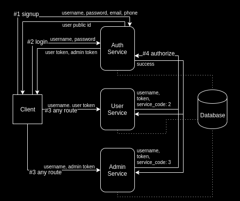

# i-love-rust-examples
This is a async websocket server template, with nice codegen included. Every tool required from Data Access Layer to backend endpoints are generated without user intervention.

This project is a microservice implementation.

## How to build

```shell
cargo build
cargo build --release
```

You can find the binary in `target/debug/` or `target/release/` folder

## How to run

```shell
cargo run --bin db
```
```shell
cargo run --bin auth
```
```shell
cargo run --bin admin
```
```shell
cargo run --bin user
```

## Authentication process



All critical authentication information is in the `Sec-Websocket-Protocol` header.
Variables in the `Sec-Websocket-Protocol` header are prefixed with an id number and separated by commas. The first variable (prefixed by zero) is always the auth service method.

#### #1: Signup

Example headers:
`Connection: upgrade`
`Upgrade: websocket`
`Sec-WebSocket-Version: 13`
`Accept: sec-websocket-accept`
`Sec-WebSocket-Protocol: 0signup,1user_one,2placeholder_password,3user_one@gmail,4+00123456,5true,6true`
Here in the `Sec-Websocket-Protocol` header we have the signup method as the first variable, followed by the user's desired username, password, email, phone, and the last two booleans refer to if the user agreed to the Terms of Service and Terms of Privacy, respectively.

The signup method validates that the username is unique, create the user with the default role 'user', and on success returns the username and a public id generated for the user.

#### #2: Login

Example headers:
`Connection: upgrade`
`Upgrade: websocket`
`Sec-WebSocket-Version: 13`
`Accept: sec-websocket-accept`
`Sec-WebSocket-Protocol: 0login,1user_one,2placeholder_password,32,43849823798,5android`
Here in the `Sec-Websocket-Protocol` header we have the login method as the first variable, followed by the user's registered username, password, service_code (the service the user is logging into), device id, and device OS.

The login method validates that the password hash matches the registered password for the user, and that the requested service matches the user's role, and on success returns the username, the user's public id, and 2 tokens generated for the user, 1 'user' token and 1 'admin' token. These tokens are to match the requested service when calling Authorize (see below) but will only be valid if the user has the necessary role to use the service.

#### #3 + #4: Route with Authorize as middleware

Example headers:
`Connection: upgrade`
`Upgrade: websocket`
`Sec-WebSocket-Version: 13`
`Accept: sec-websocket-accept`
`Sec-WebSocket-Protocol: 0authorize,1user_one,2371a695c-b4c1-47b0-b779-638fdc47b4ac,32,43849823798,5android`
Here in the `Sec-Websocket-Protocol` header we have the authorize method as the first variable, followed by the user's registered username, user or admin token (will be validated according to the chosen service), service_code (the service the user is being authorized into, must match the token), device id, and device OS.

The authorize middleware is used with every other route, it validates that the token, a valid token must have 3 conditions:
1. the token must be the one generated for this user on Login.
2. the token must match the service the user is requesting access to.
3. the user must have the role requirements to use the token.

## Quickstart development

Install [Firecamp]

[Firecamp]: https://firecamp.io

* Import firecamp JSON request collections located in `static/`.
* You can find the JSON payloads in the **Environments** section of the collection menu.
* Don't forget to check the comments in the payloads!

## Structure explained

`src/codegen` core codegen logic

`src/gen` codegen target

`src/lib` common code

`src/service` implementation of services

`src/service/{srv}/main.rs` main entry of service

`src/service/{srv}/endpoints.rs` declaration of endpoints

`src/service/{srv}/pg_func.rs` declaration of postgres procedural endpoints (DALs)

`src/service/{srv}/method.rs` implementation of endpoints

`tests` integration tests

`benches` benchmarks

`docs` documentation

`db` database related files

`etc` configuration files

`scripts` helper scripts
